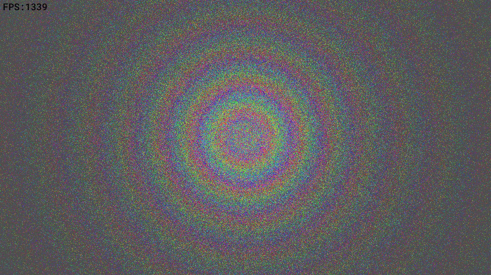

# Creese 3D - WIP

Creese 3D is the next evolution of [Creese 2D](https://github.com/satchelfrost/creese_2d). 
Unlike Creese 2D which was a CPU software renderer, Creese 3D is a GPU-based software renderer. That is, all of the
rendering/rasterizing is done with compute shaders.

